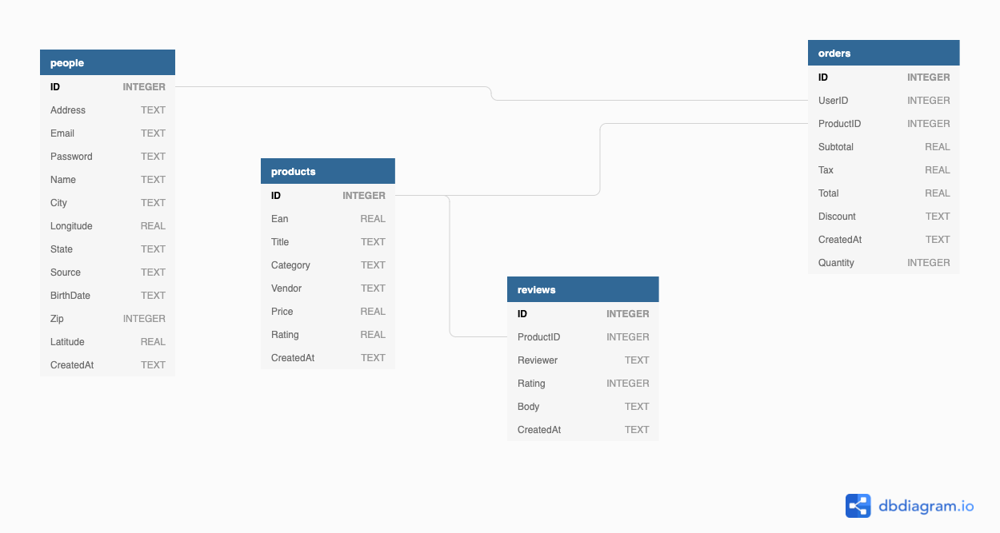



# SQL Workshop

## SQL, What Is It?

SQL (Structured Query Language) is a querying language, plain and simple.
If you've ever used formulas in Excel or Google Sheets, you'll feel some
familiarity here. The reason why SQL enters the conversation is at some point
the spreadsheet gets too large that it slows down, has too many sheets,
or the formulas get too complex to maintain.

## Why Learn It?

SQL has a place in every industry:

* Software development
* Business intelligence
* Marketing analysis
* Algorithmic trading
* Data visualization
* Basically anywhere where there is data

It is undoubtedly one of the most valuable skills you can have in any role that
typical involves a spreadsheet, period.

## What does it look like

First, let's contrast it to what we may already know about spreadsheets.

Sheet => Table

Spreadsheet (many sheets) => SQL Database (many tables)

That's it. The jargon isn't too bad. Let's take a look at this spreadsheet, made up of many sheets.

<iframe src="https://docs.google.com/spreadsheets/d/e/2PACX-1vTTXN-1_aA94PnyhXiS_Cgq_NZ715Ykm-NtOfiPNoVzvuJvdWKfK6zrVHNUnqpIc-4OZRCLIREFTHX3/pubhtml?widget=true&amp;headers=false" width="100%" height="600" frameborder="0"></iframe>

In the right panel, we have a query-able representation of the database we'll be playing with, (or you can <a href="https://austindevs.github.io/sqljs.org/" target="blank">open in a new window</a>)

<iframe src="https://austindevs.github.io/sqljs.org/" width="50%" height="700" frameborder="0" style="float:right"></iframe>

### Querying

The most basic query is to just list everything from a single table. Let's look
at the `products` table.

1. First, we will **always** `SELECT` the fields that we want: `SELECT products.Title, products.Price`
2. Then we will **always** say `FROM` where the data is coming: `FROM products`

These are the absolutely necessary part of every query

```sql
-- You can write comments like this
SELECT products.Title, products.Price
FROM products; -- End your query with a semicolon
```

#### `ORDER BY`

So maybe not too impressive. Let's try some magic tricks. Maybe we can start by
`ORDER`ing them `BY` price.

```sql
SELECT products.Title, products.Price
FROM products
ORDER BY products.Price;
```

This will order by _ascending_ order (small to big)
You can also flip the order by using `DESC` (big to small)

```sql
SELECT products.Title, products.Price
FROM products
ORDER BY products.Price DESC;
```

#### `WHERE`

And what if we only want 'Watches', sorted by most expensive?

```sql
SELECT products.Title, products.Price
FROM products
WHERE products.Title LIKE '%watch%' -- The two % let us search the whole phrase for the word 'watch'
ORDER BY products.Price DESC;
```

Notice the order of the `WHERE` and the `ORDER BY` statements. The order of these
statements are the first "gotcha". A quick cheatsheet for the order of the most
popular statements is

1. `SELECT`
2. `FROM`
3. `JOIN`
4. `WHERE`
5. `GROUP BY`
6. `ORDER BY`
7. `LIMIT`

#### `JOIN`

`JOIN` is one of the most powerful features of a relational database. In Excel,
you might have used something similar like `VLOOKUP`, but SQL `JOIN`s are much
more powerful.

If you like puzzles, you'll love joining. It's all about finding a column on
one table that matches values on another table. For instance, look up at the
`people` table, and notice it has a `ID` column. This is called the
**Primary Key**, meaning that every product can be associated with this id, and
there are no duplicates.

Now look at the `orders` table. It has a `UserID` column. Each one of these
numbers is referring to an ID on the `people` table. This is called a **Foreign Key**.
You can have duplicates in this column because multiple `orders` can belong to the
same person. Let's join these tables together and view the user's name and email for every order's total!

Let's start with gathering our orders

```sql
SELECT orders.Total
FROM orders;
```

Let's join `people` on `orders`!

```sql
SELECT orders.Total, people.Name, people.Email
FROM orders
JOIN people ON orders.UserID = people.ID;
```

Here is a map of our database to help solve our "mazes"



#### `GROUP BY`

That's a real nice query, but that's a lot of duplicate data such as emails and names. And what if I want
to know how much each customer has spent in all? Or how many orders each customer had? We
can run another query to `GROUP BY` on a column that should be unique:

```sql
SELECT orders.Total, people.Name, people.Email
FROM orders
JOIN people ON orders.UserID = people.ID
GROUP BY people.Email;
```

So this squeezed the `people.Email`s together so there are now no duplicates, but
it just gives the first order, not very helpful. What we can't see here is that
all the orders are squished together also, even though it is only showing the first.
We can count those albums using the `COUNT` function

```sql
SELECT COUNT(people.Email), orders.Total, people.Name, people.Email
FROM orders
JOIN people ON orders.UserID = people.ID
GROUP BY people.Email;
```
And we can `SUM` toegether the squished totals.

```sql
SELECT COUNT(people.Email), SUM(orders.Total), people.Name, people.Email
FROM orders
JOIN people ON orders.UserID = people.ID
GROUP BY people.Email;
```

Let's clean up these columns a little:

```sql
SELECT
   COUNT(people.Email) AS 'Number of Invoices',
   ROUND(SUM(orders.Total), 2) AS 'Total',
   people.Name,
   people.Email
FROM orders
JOIN people ON orders.UserID = people.ID
GROUP BY people.Email;
```

Using our `ORDER BY` and `DESC` statement, we can see who has orderd from us the most times!

```sql
SELECT
   COUNT(people.Email) AS 'Number of Invoices',
   ROUND(SUM(orders.Total), 2) AS 'Total',
   people.Name,
   people.Email
FROM orders
JOIN people ON orders.UserID = people.ID
GROUP BY people.Email
ORDER BY COUNT(people.Email) DESC;
```

#### `LIMIT`

`LIMIT` is pretty straightforward. It returns only the number of rows you need.
Let's return the top 10 `people` with the biggest `Total` spend.

```sql
SELECT
   COUNT(people.Email) AS 'Number of Invoices',
   ROUND(SUM(orders.Total), 2) AS 'Total',
   people.Name,
   people.Email
FROM orders
JOIN people ON orders.UserID = people.ID
GROUP BY people.Email
ORDER BY SUM(orders.Total) DESC
LIMIT 10;
```

Resources and tutorials:

* [SQL Zoo](https://sqlzoo.net/)
* [Codecademy: Learn SQL](https://www.codecademy.com/learn/learn-sql)
* [Metabase tutorial: Everything you need to know to get started in under 20 min](https://www.youtube.com/watch?v=4bNp906oOhs)
* [Metabase tutorial: Everything you need to know in under 40 min](https://www.actiondesk.io/blog/metabase-tutorial-everything-you-need-to-know-in-under-40min)


